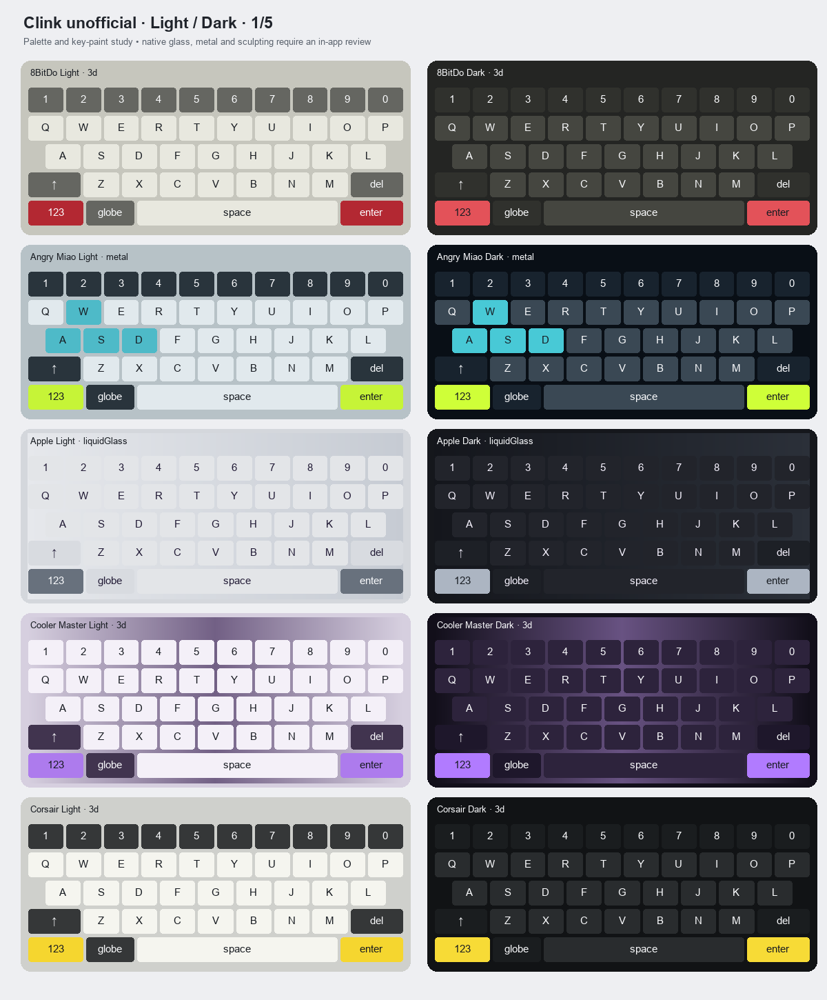
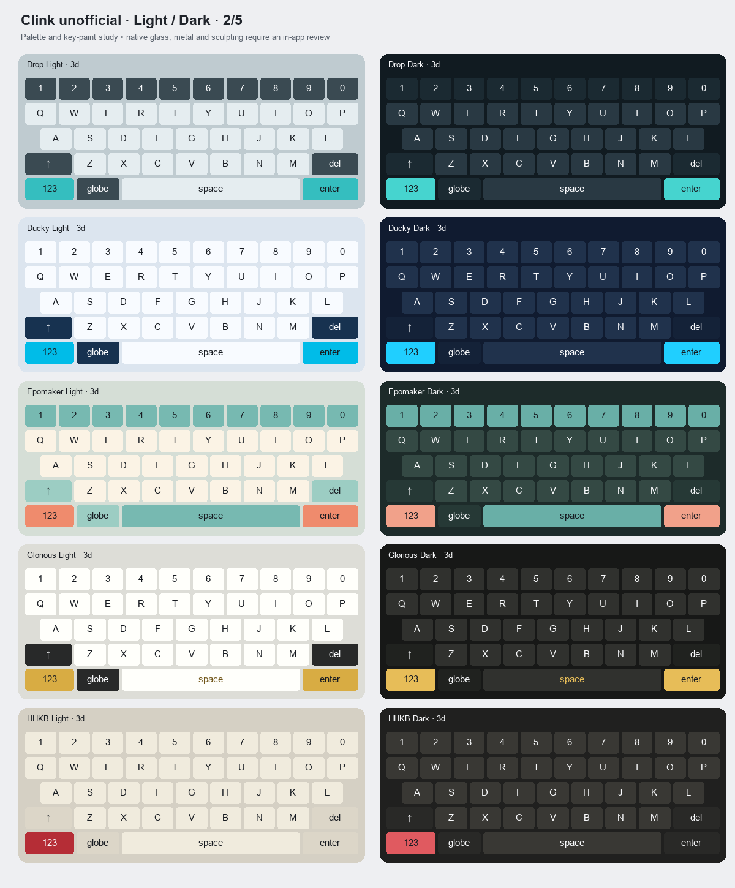
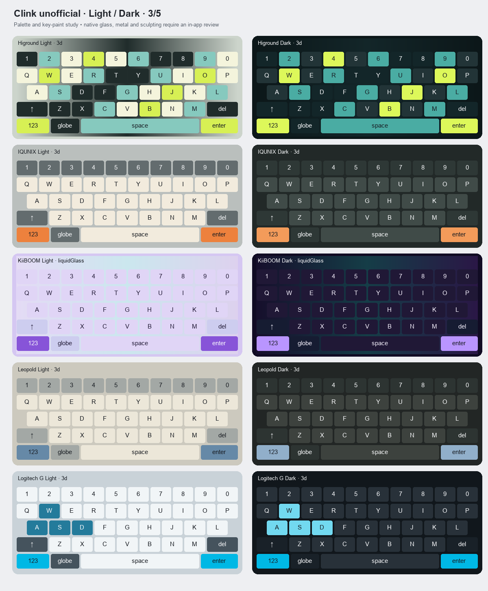
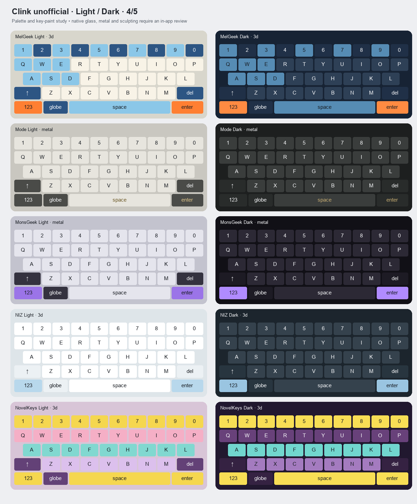
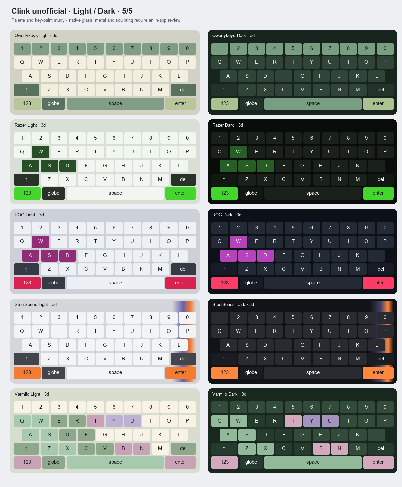

# Brand theme review — 12 September 2026

Added 25 brand pairs (50 files), completing the requested 30 brands / 60 themes. The first five pairs are byte-for-byte unchanged.

## Validation

- All 60 files parse as JSON, have unique matching filename/IDs, and have a corresponding Light/Dark partner.
- All 50 new files use fields checked against Clink’s Theme and KeyPaint model definitions; colour components are finite and within 0–1. No image references or artwork assets are embedded.
- Base letter, modifier, per-key and explicitly configured active-state legend contrast is at least 4.51:1 across the new themes. Translucent fills were composited against declared background colours and gradient stops. See [the measurements](theme-audit.json).
- The manifest was regenerated. All four release-manifest tests pass, including asset hashes, sizes, immutable URLs and cached-release preservation.
- `git diff --check` passes.
- `make check-localization` fails in the app workspace on five existing missing strings: “Export recorded swipes”, “Export recorded taps”, “No measurement on the clipboard”, “Type a number with its unit — like 19cm, 5kg or 20°C — then open Conversion.” and “Use copied text”. These theme changes introduce no application UI strings; theme names retain the existing user-content naming convention.

## Visual review

The sheets below are palette/paint mockups, not device screenshots. They show resting states on a representative QWERTY layout. Native metal shading, mechanical geometry, glass refraction, key gradients and pressed states are not reproduced by these simplified drawings. Glass appearance and rendered contrast still need an in-app check on the target OS. All five sheets were inspected for coherent light/dark palettes and key placement.

Character paint follows the character across layouts. Higround uses original colour bands, and Varmilo uses botanical colour clusters, within the repository’s data-only format. Neither includes an illustration or a bundled image. Theme files and documentation are prepared locally; no release was published.

